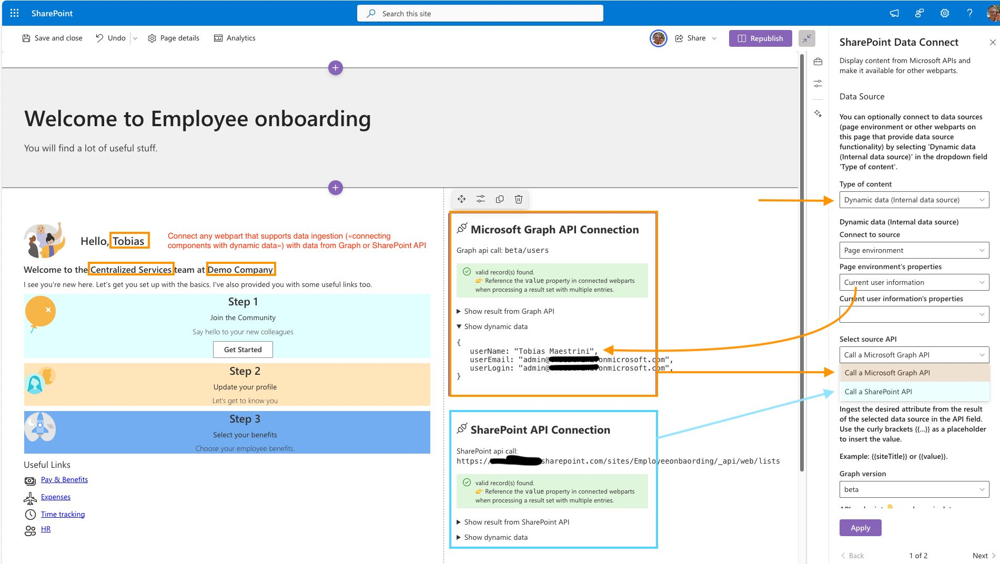

# tmaestrini-spo-data-connector

## Summary

This SharePoint Framework (SPFx) web part integrates with following data APIs: Microsoft Graph and SharePoint. 

It allows users to configure the appropriate API endpoints by defining the api version and query parameters through the property pane. The web part dynamically fetches data from the specified APIs and passes the result as so called "dynamic data" to connected webpart(s). 

It also supports the definition of input parameters from dynamic data sources and therefore provides a dynamic and flexible way to connect and display data from various service endpoints (within Microsoft 365) on SharePoint pages.

> [!NOTE]
> The webpart (and its setup) are only visible in `Edit` mode of the SharePoint page.

## Used SharePoint Framework Version

## Applies to

- [SharePoint Framework](https://aka.ms/spfx)
- [Microsoft 365 tenant](https://docs.microsoft.com/en-us/sharepoint/dev/spfx/set-up-your-developer-tenant)

> Get your own free development tenant by subscribing to [Microsoft 365 developer program](http://aka.ms/o365devprogram)

## Prerequisites

> [!WARNING]
> As with any SPFx web part, you should always be very careful and clear when granting (Graph) permissions and assign them to users. **As the current implementation is based on the `SharePoint Online Client Extensibility Web Application Principal`, this could lead to a very serious security discussion**. The authorization setup can probably change in further iterations. For now, make sure you use this solution in a "controlled" / "governed" scenario. You do this at your own risk.

The Microsoft Graph requests made by this web part rely on appropriate Microsoft Graph permissions. Therefore, all desired permissions must be granted by a Global admin through this Entra ID app: `SharePoint Online Client Extensibility Web Application Principal`. This ensures that the web part can access the required data and perform the necessary operations using Microsoft Graph API.

## Solution

| Solution | Author(s)                                 |
| -------- | ----------------------------------------- |
| 1.0.0    | Tobias Maestrini, [@tmaestrini.bsky.social](https://bsky.app/profile/tmaestrini.bsky.social) |

## Version history

| Version | Date         | Comments                                                  |
| ------- | ------------ | --------------------------------------------------------- |
| 1.2     | Dec 09, 2024 | improve data handling and add webpart information display |
| 1.1     | Nov 28, 2024 | add SPO api data connector                                |
| 1.0     | Nov 25, 2024 | Initial release                                           |

## Disclaimer

**THIS CODE IS PROVIDED _AS IS_ WITHOUT WARRANTY OF ANY KIND, EITHER EXPRESS OR IMPLIED, INCLUDING ANY IMPLIED WARRANTIES OF FITNESS FOR A PARTICULAR PURPOSE, MERCHANTABILITY, OR NON-INFRINGEMENT.**

---

## Minimal Path to Awesome

- Clone this repository
- Ensure that you are at the solution folder
- in the command-line run:
  - **npm install**
  - **gulp serve**

> Include any additional steps as needed.

> [!NOTE]
> Instead of running `gulp serve`, you can install _fast-serve_ and run it via `npm run serve`.

## Features

Description of the extension that expands upon high-level summary above.

This extension illustrates the following concepts:

- topic 1
- topic 2
- topic 3

> Notice that better pictures and documentation will increase the sample usage and the value you are providing for others. Thanks for your submissions advance.

> Share your web part with others through Microsoft 365 Patterns and Practices program to get visibility and exposure. More details on the community, open-source projects and other activities from http://aka.ms/m365pnp.

## References

- [Getting started with SharePoint Framework](https://docs.microsoft.com/en-us/sharepoint/dev/spfx/set-up-your-developer-tenant)
- [Building for Microsoft teams](https://docs.microsoft.com/en-us/sharepoint/dev/spfx/build-for-teams-overview)
- [Use Microsoft Graph in your solution](https://docs.microsoft.com/en-us/sharepoint/dev/spfx/web-parts/get-started/using-microsoft-graph-apis)
- [Publish SharePoint Framework applications to the Marketplace](https://docs.microsoft.com/en-us/sharepoint/dev/spfx/publish-to-marketplace-overview)
- [Microsoft 365 Patterns and Practices](https://aka.ms/m365pnp) - Guidance, tooling, samples and open-source controls for your Microsoft 365 development
